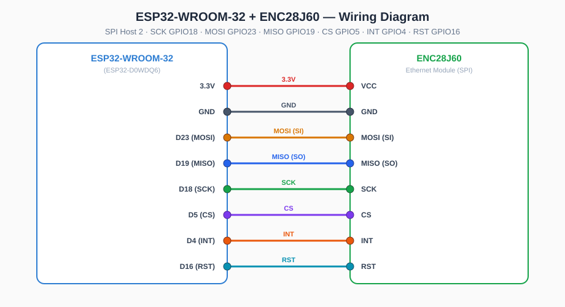

# DHCPServer

**DHCPv4 + Caching DNS Proxy Server for ESP32-WROOM-32 + ENC28J60 Ethernet**

---

## 📖 Description

DHCP server and caching DNS proxy built on **ESP32-WROOM-32** with an **ENC28J60 Ethernet module**. The device connects to the local network **over wired Ethernet (ENC28J60 via SPI)** — **WiFi is not used**. It assigns IP addresses through DHCP, proxies DNS queries with caching and logging, and is managed through a web interface (dark theme, RU/EN localization) or a UART terminal menu.

---

## ✨ Features

- **DHCPv4 Server** — configurable IP range, subnet, gateway, lease time, static MAC→IP bindings (enable + per-host DNS override)
- **DNS Proxy** — pipeline: logging → local hosts → external cache (REST) → forwarding to external DNS
- **ENC28J60 Ethernet** — wired 10 Mbps link over SPI (no WiFi)
- **Web Interface** — dark theme, RU/EN localization, DHCP/DNS sub-pages
- **REST API** — full device management over HTTP with Basic auth + rate limiting
- **OTA Updates** — firmware update via web interface, dual OTA partitions for safe upgrades
- **Terminal Menu** — UART console with `lan status`, password reset, version, reboot
- **LED Indicator** — GPIO26 LED shows link status
- **ESP-Prog Debug** — JTAG debug support via ESP-Prog

---

## 🔧 Hardware Requirements

| Component | Specification |
|-----------|--------------|
| MCU | ESP32-WROOM-32 (ESP32-D0WDQ6) |
| Ethernet | ENC28J60 SPI→Ethernet module (3.3V logic) |
| Flash | 4 MB |
| LED | GPIO26 (active high) |
| Debug | ESP-Prog (JTAG) — optional |

### ENC28J60 Wiring

The ENC28J60 is connected to the ESP32 via **SPI (Host 2)**. All signal pins are 3.3V logic.

| ENC28J60 | → | ESP32 | GPIO |
|----------|---|-------|------|
| **VCC** | → | **3.3V** | — |
| **GND** | → | **GND** | — |
| **SCK** | → | **D18** | GPIO18 |
| **MOSI (SI)** | → | **D23** | GPIO23 |
| **MISO (SO)** | → | **D19** | GPIO19 |
| **CS** | → | **D5** | GPIO5 |
| **INT** | → | **D4** | GPIO4 |
| **RST** | → | **D16** | GPIO16 |



> ⚠️ Power the ENC28J60 from **3.3V only** (never 5V). Full details: [Docs/ENC28J60.md](Docs/ENC28J60.md).

### ESP-Prog Connection

| ESP-Prog | ESP32 |
|----------|-------|
| TDI | GPIO12 |
| TDO | GPIO15 |
| TCK | GPIO13 |
| TMS | GPIO14 |
| GND | GND |
| 3.3V | 3.3V |
| GPIO0 | GPIO0 |
| EN | EN |

---

## 🚀 Quick Start

### Prerequisites

- [PlatformIO](https://platformio.com/) (VS Code extension or CLI)
- Python 3.8+
- ESP32-WROOM-32 board + ENC28J60 module (see wiring above)

### Build

```bash
# Clone the repository
git clone <repo-url> DHCPServer
cd DHCPServer

# Build the debug environment (ESP-Prog / JTAG)
pio run -e esp32dev-debug
```

### Flash (user action)

```bash
# 1. Firmware
pio run -e esp32dev-debug --target upload

# 2. SPIFFS web content (run separately!)
pio run -e esp32dev-debug --target uploadfs

# Monitor serial output
pio run -e esp32dev-debug --target monitor
```

> ⚠️ `--target upload --target uploadfs` in a single command flashes SPIFFS twice and skips the firmware. Always run them separately, then reboot the device.

### Debug with ESP-Prog

```bash
# Build and upload via ESP-Prog
pio run -e esp32dev-debug --target upload

# Start debug session
pio debug -e esp32dev-debug
```

Or use the VS Code launch configuration:
1. Select `ESP-Prog Debug` in Run & Debug panel
2. Press F5

---

## ⚙️ Configuration

### Static IP Addresses

| Protocol | Address |
|----------|---------|
| IPv4 | `192.168.1.201` |
| IPv6 | `fd12:3456:789a:0001:021b:21ff:fe6b:8c4d` |
| External DNS | `192.168.1.1` |

Configured in `src/eth/EthManager.cpp`.

### Firmware Version

Defined in menuconfig (`Kconfig.projbuild`) or `sdkconfig.defaults`:

| Field | Format | Default | Description |
|-------|--------|---------|-------------|
| `aa` | 00-99 | `01` | Global version |
| `bb` | 00-99 | `02` | Device/product code |
| `xxx` | 000-999 | `028` | Release number |
| `cc` | 00-99 | `00` | Sub-release |
| `YY` | 00-99 | `26` | Year (2026) |
| `MM` | 01-12 | `08` | Month |
| `RR` | 2 chars | `RU` | Region |

Example: `01.02.028.00.26.08.RU` — see [Docs/FirmwareVersion.md](Docs/FirmwareVersion.md).

### Partition Table

| Partition | Offset | Size | Usage |
|-----------|--------|------|-------|
| phy_init | 0xF000 | 4 KB | RF calibration |
| otadata | 0x10000 | 8 KB | OTA boot selection |
| nvs | 0x12000 | 24 KB | Configuration storage |
| ota_0 | 0x20000 | 1.5 MB | OTA app slot 0 |
| ota_1 | 0x1A0000 | 1.5 MB | OTA app slot 1 |
| spiffs | 0x320000 | 896 KB | Web interface files |

---

## 🖥️ Web Interface

Access: `http://192.168.1.201` (default static IP)

**Default login:** `admin` / `admin`

### Pages

| Page | Route | Description |
|------|-------|-------------|
| Home | `/index.html` | System status (network, RAM, storage usage) |
| DHCP ▾ Setup | `/pages/dhcp_setup.html` | Server status, IP, address range |
| DHCP ▾ Logging | `/pages/dhcp_logging.html` | DHCP REST logging (URL/auth/Test) |
| DHCP ▾ DNS | `/pages/dhcp_dns.html` | Built-in DNS status, mode/address |
| DHCP ▾ Static Bindings | `/pages/dhcp_static.html` | Static MAC→IP bindings (enable/DNS) |
| DNS ▾ Setup | `/pages/dns_setup.html` | DNS forwarding, mode/address |
| DNS ▾ Logging | `/pages/dns_logging.html` | DNS REST logging |
| DNS ▾ Cache | `/pages/dns_cache.html` | External cache URL, cache stats |
| DNS ▾ Local Hosts | `/pages/dns_local_hosts.html` | Local domain→IP mappings |
| Security | `/pages/security.html` | Auth settings, rate limiting |
| Help ▾ Version | `/pages/version.html` | Firmware version info |

### Language

Toggle between Russian and English using the RU/EN buttons in the navigation bar.

---

## 📡 REST API

All endpoints require HTTP Basic Authentication.

### Endpoints

| Method | Route | Description |
|--------|-------|-------------|
| GET | `/api/status` | System status (network, DHCP, DNS, CPU, RAM, storage usage) |
| GET | `/api/version` | Firmware version string |
| GET | `/api/dhcp/settings` | DHCP configuration |
| POST | `/api/dhcp/settings` | Update DHCP configuration |
| GET | `/api/dhcp/static-bindings` | Static MAC→IP bindings |
| POST | `/api/dhcp/static-bindings` | Update static bindings |
| GET | `/api/dhcp/leases` | Active DHCP leases |
| GET | `/api/dns/settings` | DNS configuration |
| POST | `/api/dns/settings` | Update DNS configuration |
| GET | `/api/dns/local-hosts` | Local DNS host mappings |
| POST | `/api/dns/local-hosts` | Update local DNS host mappings |
| GET | `/api/security/settings` | Security settings (no password) |
| POST | `/api/security/settings` | Update security settings |
| POST | `/api/ota/upload` | Upload firmware (multipart) |
| POST | `/api/test-connection` | Test a REST endpoint from the device |

Full documentation: [Docs/Rest.md](Docs/Rest.md)

---

## ⌨️ Terminal Menu

Connect via serial at 115200 baud.

```
dhcp> help
Available commands:
  lan status                  — Show LAN connection status and IP
  passwd reset                — Reset web password to default (admin)
  version                     — Show firmware version
  help                         — Show this help
  reboot                      — Reboot the device
```

> The `lan status` command reports the wired ENC28J60 link through the `IWiFiManager` interface (implemented by `EthWifiAdapter`).

---

## 🏗️ Project Structure

```
DHCPServer/
├── platformio.ini          # PlatformIO configuration
├── sdkconfig.defaults      # ESP-IDF defaults
├── partitions/
│   └── dhcp_partitions.csv # Custom partition table
├── src/
│   ├── main.cpp            # Application entry point
│   ├── core/               # Version, Config
│   ├── eth/                # ENC28J60 Ethernet manager
│   ├── dhcp/               # DHCP server
│   ├── dns/                # DNS proxy, cache, logger
│   ├── web/                # HTTP server, auth, REST API
│   ├── led/                # LED controller
│   ├── menu/               # Terminal menu
│   └── storage/            # SPIFFS wrapper
├── data/                   # SPIFFS web content
│   ├── index.html
│   ├── css/style.css
│   ├── js/app.js
│   ├── i18n/{ru,en}.json
│   └── pages/
├── test/                   # Unit tests
├── Docs/                   # Documentation
│   ├── History.md
│   ├── Dialog.md
│   ├── Rest.md
│   └── PartitionTable.md
└── Plan/                   # Project planning
    ├── Task.md
    ├── Structure.md
    ├── Stages.md
    └── Hardware.md
```

---

## 🧪 Testing

```bash
# Build and run tests on device
pio test -e esp32dev
```

Test files:
- `test/test_version.cpp` — Version formatting and components
- `test/test_config.cpp` — Config read/write roundtrip
- `test/test_wifi.cpp` — LED controller
- `test/test_dhcp.cpp` — DHCP server lifecycle
- `test/test_dns.cpp` — DNS cache stub
- `test/test_auth.cpp` — Auth manager with lockout

---

##  License

This project is licensed under the MIT License — see the [LICENSE](LICENSE) file for details.

