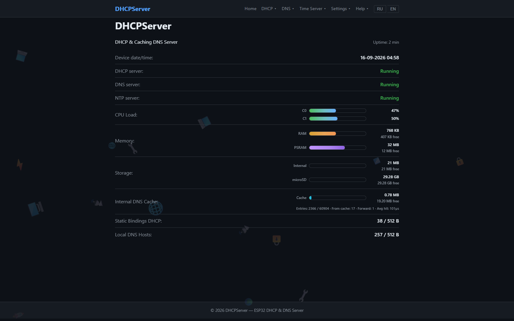
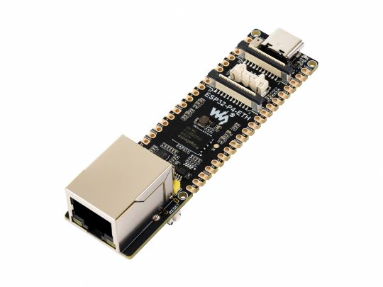

# DHCPServer

**DHCPv4 + Caching DNS Proxy Server for Waveshare ESP32-P4-ETH**

---



---

## 📖 Description

DHCP server and caching DNS proxy built on the **Waveshare ESP32-P4-ETH** (dual-core RISC-V **ESP32-P4**). The device connects to the local network **over the onboard 10/100 Ethernet** (internal EMAC + **IP101GRI** PHY) — **WiFi/Bluetooth are not available on the ESP32-P4**. It assigns IP addresses through DHCP, proxies DNS queries with caching and logging, and is managed through a web interface (dark theme, RU/EN localization) or a UART terminal menu.

---

## ✨ Features

- **DHCPv4 Server** — configurable IP range, subnet, gateway, lease time, static MAC→IP bindings (enable + per-host DNS override)
- **DNS Proxy** — pipeline: logging → local hosts → external cache (REST) → forwarding to external DNS
- **Onboard Ethernet 10/100** — internal EMAC + IP101GRI PHY over RMII (no WiFi — ESP32-P4 has no radio)
- **Web Interface** — dark theme, RU/EN localization, DHCP/DNS sub-pages
- **REST API** — full device management over HTTP with Basic auth + rate limiting
- **OTA Updates** — firmware update via web interface, dual OTA partitions for safe upgrades
- **Terminal Menu** — UART console with `lan status`, password reset, version, reboot
- **Link Status LED** — link status indication on boards with a user LED; compiled out on the ESP32-P4-ETH (it has no user LED)
- **UART Console & Flashing** — via onboard USB-C / CH343P

---

## 🔧 Hardware — Waveshare ESP32-P4-ETH

The project targets the **Waveshare ESP32-P4-ETH** development board. Ethernet is
**onboard** (10/100 RJ45) — no external Ethernet module or wiring is required.



| Component | Specification |
|-----------|--------------|
| Board | Waveshare ESP32-P4-ETH |
| MCU | ESP32-P4 NRW32 — ESP32-P4 module, dual-core RISC-V (max **360 MHz** on this silicon revision) |
| Ethernet | Onboard 10/100 Mbps RJ45 — internal EMAC + **IP101GRI** PHY (RMII) |
| Flash | GigaDevice 25Q256EY1G — SPI NOR, 256 Mbit (**32 MB**) |
| PSRAM | 32 MB (stacked in the ESP32-P4 module) |
| USB-UART | **CH343P** — USB-C → UART/TTL (console + flashing) |
| Audio | **ES8311** codec + **NS4150B** 3 W power amplifier (mic / speaker) |
| Wi-Fi / BT | — (not available on ESP32-P4) |
| LED | only a power indicator on board — no user LED; the link-status LED feature is compiled out (GPIO `-1`) |

### Onboard Chips

| Chip | Manufacturer | Function |
|------|--------------|----------|
| **ESP32-P4 NRW32** (FEFO FMDD297) | Espressif Systems | Dual-core RISC-V microcontroller, 32 MB PSRAM |
| **IP101GRI** | IC Plus Corp | 10/100 Ethernet PHY transceiver (RMII) |
| **25Q256EY1G** | GigaDevice | SPI NOR flash, 256 Mbit (32 MB) |
| **CH343P** | WCH | USB → high-speed UART/TTL bridge (console) |
| **ES8311** | Everest Semiconductor | Low-power mono audio codec (DAC/ADC) |
| **NS4150B** | — | Audio power amplifier, 3 W × 1 |

### Flashing & Console

Connect the board to the PC over **USB-C**. The onboard **CH343P** exposes the
ESP32-P4 UART0 console and the ROM bootloader. Hold **BOOT** while resetting to
enter download mode.

---

## 🚀 Quick Start

> The firmware is **target-conditional** (`CONFIG_IDF_TARGET_ESP32P4`). The
> ESP32-P4 path drives the internal RMII EMAC + **IP101GRI** PHY; the classic
> ESP32 path drives an **ENC28J60** over SPI. Both share the same
> DHCP/DNS/web application code.

### Option A — ESP32 + ENC28J60 (PlatformIO)

Reference/legacy target — the ENC28J60 code path is preserved and fully
buildable with PlatformIO.

**Prerequisites:** [PlatformIO](https://platformio.com/), Python 3.8+, an
ESP32-WROOM-32 board + ENC28J60 module (wiring in `Docs/ENC28J60.md`).

```bash
# Build firmware
pio run -e esp32dev

# Flash firmware + SPIFFS web content (run separately!)
pio run -e esp32dev --target upload
pio run -e esp32dev --target uploadfs

# Monitor serial output
pio run -e esp32dev --target monitor
```

> ⚠️ Never combine `--target upload --target uploadfs` in one command — SPIFFS
> would be flashed twice and the firmware skipped. Run them separately, then
> reboot the device.

### Option B — ESP32-P4-ETH (native ESP-IDF)

> ⚠️ PlatformIO's `espressif32` platform does **not** yet ship an ESP32-P4 MCU
> or board definition (verified up to v7.0.1, which bundles ESP-IDF 6.0.1), so
> the ESP32-P4 target is built with the **native ESP-IDF** toolchain (≥ v6.0).
> No `[env:esp32-p4-eth]` exists in `platformio.ini` on purpose.

**Prerequisites:** ESP-IDF 6.0+ with the RISC-V toolchain (`riscv32-esp-elf`)
and the Waveshare ESP32-P4-ETH board (onboard Ethernet — no extra module).

```powershell
# 1. Select the ESP32-P4 target (applies sdkconfig.defaults.esp32p4)
idf.py set-target esp32p4

# 2. Build
idf.py build

# 3. Flash firmware, then monitor the console
idf.py -p COMx flash
idf.py -p COMx monitor

# 4. Upload the web UI (SPIFFS) — native ESP-IDF has no "uploadfs"
.\scripts\upload_web_p4.ps1 -Port COMx
```

> ⚠️ PlatformIO's `uploadfs` does not exist for the ESP32-P4 — the web content
> (`data/`) lives in a separate SPIFFS partition and is uploaded with
> [`scripts/upload_web_p4.ps1`](scripts/upload_web_p4.ps1) (flash the firmware
> first, then the web UI).

Target configuration files for this build:

- [`sdkconfig.defaults.esp32p4`](sdkconfig.defaults.esp32p4) — EMAC instead of
  SPI Ethernet, 32 MB flash, silicon rev v1.3 support, partition table override.
- [`partitions/dhcp_partitions_p4.csv`](partitions/dhcp_partitions_p4.csv) —
  32 MB partition table (2× OTA + 8 MB SPIFFS).

Full build/flash/web-UI/OTA/troubleshooting walkthrough:
[`Docs/ESP32-P4-ETH.md`](Docs/ESP32-P4-ETH.md). Partition layout details are in
[`Docs/PartitionTable.md`](Docs/PartitionTable.md).

---

## ⚙️ Configuration

### Static IP Addresses

| Protocol | Address |
|----------|---------|
| IPv4 | `192.168.1.201` |
| IPv6 | `fd12:3456:789a:0001:021b:21ff:fe6b:8c4d` |
| External DNS | `192.168.1.1` |

Configured in `src/eth/EthManager.cpp`.

### Firmware Version

Defined in menuconfig (`Kconfig.projbuild`) or `sdkconfig.defaults`:

| Field | Format | Default | Description |
|-------|--------|---------|-------------|
| `aa` | 00-99 | `01` | Global version |
| `bb` | 00-99 | `02` | Device/product code |
| `xxx` | 000-999 | `028` | Release number |
| `cc` | 00-99 | `00` | Sub-release |
| `YY` | 00-99 | `26` | Year (2026) |
| `MM` | 01-12 | `08` | Month |
| `RR` | 2 chars | `RU` | Region |

Example: `01.02.028.00.26.08.RU` — see [Docs/FirmwareVersion.md](Docs/FirmwareVersion.md).

### Partition Table

The repo ships two tables: the legacy 4 MB table for the ESP32
([`partitions/dhcp_partitions.csv`](partitions/dhcp_partitions.csv)) and a
32 MB table for the ESP32-P4-ETH
([`partitions/dhcp_partitions_p4.csv`](partitions/dhcp_partitions_p4.csv)).
The ESP32-P4 uses the internal 32 MB flash with the `phy_init`/RF-calibration
partition removed (no 2.4 GHz radio) and much larger OTA slots.

**ESP32-P4-ETH layout (32 MB, `dhcp_partitions_p4.csv`):**

| Partition | Offset | Size | Usage |
|-----------|--------|------|-------|
| nvs | 0x9000 | 24 KB | Configuration storage |
| otadata | 0x10000 | 8 KB | OTA boot selection |
| ota_0 | 0x20000 | 5 MB | OTA app slot 0 |
| ota_1 | 0x520000 | 5 MB | OTA app slot 1 |
| spiffs | 0xA20000 | 8 MB | Web interface files |

**Legacy ESP32 layout (4 MB, `dhcp_partitions.csv`):**

| Partition | Offset | Size | Usage |
|-----------|--------|------|-------|
| phy_init | 0xF000 | 4 KB | RF calibration |
| otadata | 0x10000 | 8 KB | OTA boot selection |
| nvs | 0x12000 | 24 KB | Configuration storage |
| ota_0 | 0x20000 | 1.5 MB | OTA app slot 0 |
| ota_1 | 0x1A0000 | 1.5 MB | OTA app slot 1 |
| spiffs | 0x320000 | 896 KB | Web interface files |

---

## 🖥️ Web Interface

Access: `http://192.168.1.201` (default static IP)

**Default login:** `admin` / `admin`

### Pages

| Page | Route | Description |
|------|-------|-------------|
| Home | `/index.html` | System status (network, RAM, storage usage) |
| DHCP ▾ Setup | `/pages/dhcp_setup.html` | Server status, IP, address range |
| DHCP ▾ Logging | `/pages/dhcp_logging.html` | DHCP REST logging (URL/auth/Test) |
| DHCP ▾ DNS | `/pages/dhcp_dns.html` | Built-in DNS status, mode/address |
| DHCP ▾ Static Bindings | `/pages/dhcp_static.html` | Static MAC→IP bindings (enable/DNS) |
| DNS ▾ Setup | `/pages/dns_setup.html` | DNS forwarding, mode/address |
| DNS ▾ Logging | `/pages/dns_logging.html` | DNS REST logging |
| DNS ▾ Cache | `/pages/dns_cache.html` | External cache URL, cache stats |
| DNS ▾ Local Hosts | `/pages/dns_local_hosts.html` | Local domain→IP mappings |
| Security | `/pages/security.html` | Auth settings, rate limiting |
| Help ▾ Version | `/pages/version.html` | Firmware version info |

### Language

Toggle between Russian and English using the RU/EN buttons in the navigation bar.

---

## 📡 REST API

All endpoints require HTTP Basic Authentication.

### Endpoints

| Method | Route | Description |
|--------|-------|-------------|
| GET | `/api/status` | System status (network, DHCP, DNS, CPU, RAM, storage usage) |
| GET | `/api/version` | Firmware version string |
| GET | `/api/dhcp/settings` | DHCP configuration |
| POST | `/api/dhcp/settings` | Update DHCP configuration |
| GET | `/api/dhcp/static-bindings` | Static MAC→IP bindings |
| POST | `/api/dhcp/static-bindings` | Update static bindings |
| GET | `/api/dhcp/leases` | Active DHCP leases |
| GET | `/api/dns/settings` | DNS configuration |
| POST | `/api/dns/settings` | Update DNS configuration |
| GET | `/api/dns/local-hosts` | Local DNS host mappings |
| POST | `/api/dns/local-hosts` | Update local DNS host mappings |
| GET | `/api/security/settings` | Security settings (no password) |
| POST | `/api/security/settings` | Update security settings |
| POST | `/api/ota/upload` | Upload firmware (multipart) |
| POST | `/api/test-connection` | Test a REST endpoint from the device |

Full documentation: [Docs/Rest.md](Docs/Rest.md)

---

## ⌨️ Terminal Menu

Connect via serial at 115200 baud.

```
dhcp> help
Available commands:
  lan status                  — Show LAN connection status and IP
  passwd reset                — Reset web password to default (admin)
  version                     — Show firmware version
  help                         — Show this help
  reboot                      — Reboot the device
```

> The `lan status` command reports the wired Ethernet link through the `IWiFiManager` interface (implemented by `EthWifiAdapter`).

---

## 🏗️ Project Structure

```
DHCPServer/
├── CMakeLists.txt           # Component CMakeLists (used by ESP-IDF)
├── platformio.ini           # PlatformIO configuration (ESP32 + ENC28J60)
├── sdkconfig.defaults       # Shared ESP-IDF defaults (ESP32)
├── sdkconfig.defaults.esp32p4 # ESP32-P4-ETH overrides (EMAC, 32 MB flash)
├── partitions/
│   ├── dhcp_partitions.csv      # 4 MB table (ESP32 + ENC28J60)
│   └── dhcp_partitions_p4.csv   # 32 MB table (ESP32-P4-ETH)
├── src/
│   ├── main.cpp            # Application entry point
│   ├── CMakeLists.txt      # Component sources (wifi/ excluded on ESP32-P4)
│   ├── Kconfig.projbuild   # Project configuration options
│   ├── core/               # Version, Config
│   ├── eth/                # Ethernet manager (ENC28J60 SPI on ESP32 /
│   │                       #   internal EMAC + IP101GRI on ESP32-P4-ETH)
│   ├── dhcp/               # DHCP server
│   ├── dns/                # DNS proxy, cache, logger
│   ├── web/                # HTTP server, auth, REST API
│   ├── led/                # LED controller (no-op on ESP32-P4-ETH)
│   ├── menu/               # Terminal menu
│   ├── storage/            # SPIFFS wrapper
│   └── wifi/               # WiFiManager (ESP32 only — not built on ESP32-P4)
├── data/                   # SPIFFS web content
│   ├── index.html
│   ├── css/style.css
│   ├── js/app.js
│   ├── i18n/{ru,en}.json
│   └── pages/
├── test/                   # Unit tests (host-style, no board needed)
├── Docs/                   # Documentation
│   ├── ENC28J60.md
│   ├── ESP32-P4-ETH.md      # P4 build/flash/web-UI guide
│   ├── ESP-Prog.md
│   ├── FirmwareVersion.md
│   ├── History.md
│   ├── Dialog.md
│   ├── Rest.md
│   └── PartitionTable.md
└── Plan/                   # Project planning
    ├── Task.md
    ├── Structure.md
    ├── Stages.md
    └── Hardware.md
```

---

## 🧪 Testing

Each `test/test_*.cpp` defines its own `app_main()` — tests are built and run
as firmware on the board through PlatformIO against the ESP32 environment
(the shared logic classes are target-independent, so the same code is what the
ESP32-P4 build compiles too):

```bash
pio test -e esp32dev
```

> No `[env:esp32-p4-eth]` test target exists (the `espressif32` PIO platform
> has no ESP32-P4 support) — test the ESP32 build, then flash the ESP32-P4
> build via native `idf.py` (see [Quick Start](#-quick-start)).

Test files:
- `test/test_version.cpp` — Version formatting and components
- `test/test_config.cpp` — Config read/write roundtrip
- `test/test_wifi.cpp` — WiFiManager (needs hardware) and LedController
- `test/test_dhcp.cpp` — DHCP server lifecycle
- `test/test_dns.cpp` — DNS cache stub
- `test/test_auth.cpp` — Auth manager with lockout

---

##  License

This project is licensed under the MIT License — see the [LICENSE](LICENSE) file for details.

